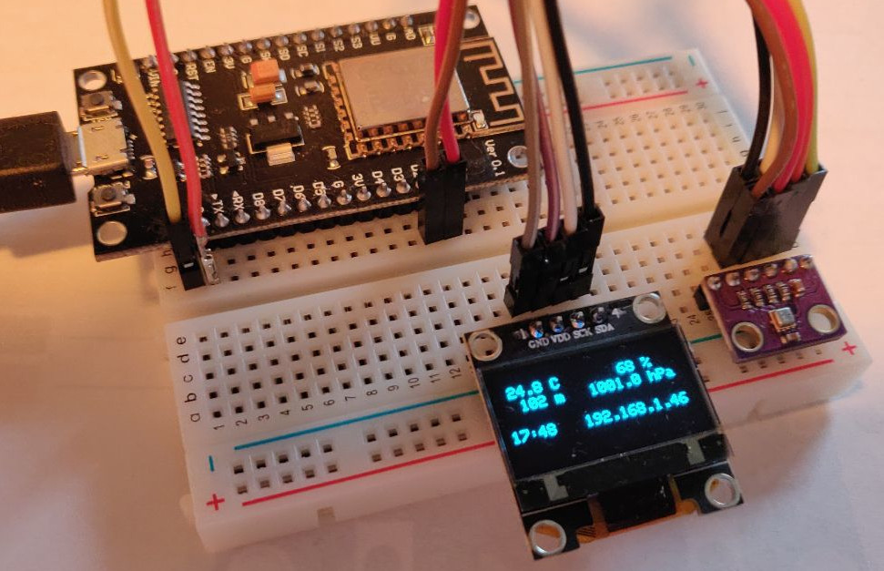
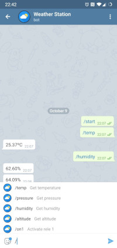

# Home automation with a nodemcu v3 via Telegram Bot



## Requeriments

- Arduino IDE and/or VSCode (via [vscode-arduino](https://marketplace.visualstudio.com/items?itemName=vsciot-vscode.vscode-arduino) plugin)
- [nodeMCU v3 devkit](https://en.wikipedia.org/wiki/NodeMCU)

## Install

- Install [CTBot library]
- Install [Adafruit BME280 Library]
- Install [Adafruit Unified Sensor]
- Install [Adafruit SSD1306 Library]
- Install [ArduinoJson library] (version 5.13.4 at the time of writing, not the last one because fails to compile!!)
- Follow instructions on how to create a Telegram Bot, via telegram bot BotFather or insiede CTBot library
- Rename file secrets.h_dist -> secrets.h changing the SSID, Password for Wifi and telegram Token
- Connect nodemcu to usb to computer
- Configure Arduino Board to nodeMCU v1.0
- Upload Sketch to nodeMCU ¹

## Issues

¹ On linux maybe is needed to allow write permissions to the USB
```
sudo chmod a+rw /dev/ttyUSB0
```

## Debug

Some information is sent to serial, so can check if the wifi is already conected

## Telegram Bot

Example bot output



Customize icon, commands via BotFather
