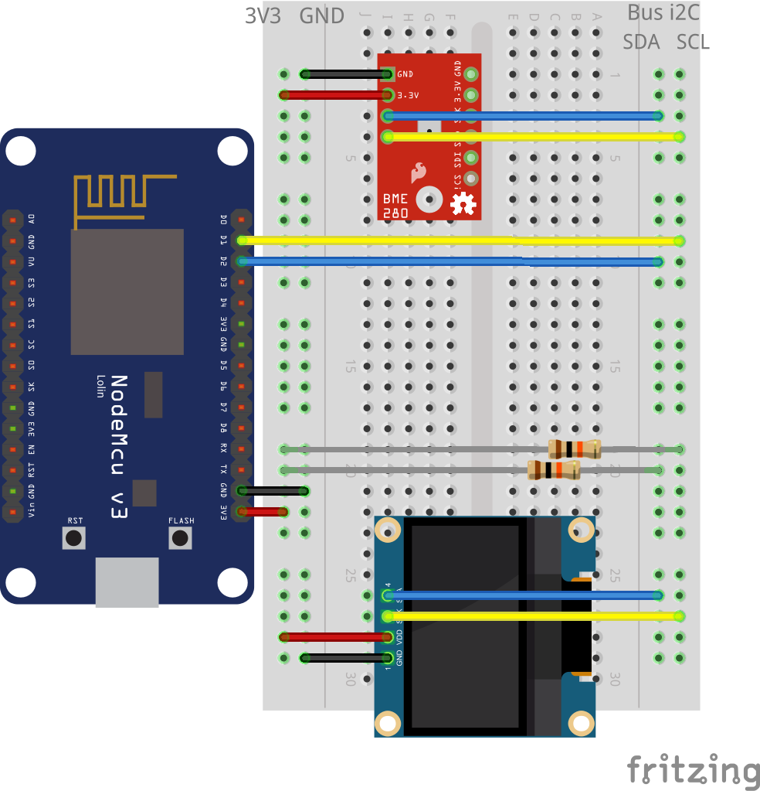

# Home automation with a nodemcu v3 via Telegram Bot


## Requeriments

- Arduino IDE and/or VSCode (via [vscode-arduino](https://marketplace.visualstudio.com/items?itemName=vsciot-vscode.vscode-arduino) plugin)
- [nodeMCU v3 devkit](https://en.wikipedia.org/wiki/NodeMCU)

## Install

- Install libraries:
  [CTBot]
  [Adafruit BME280]
  [Adafruit Unified Sensor]
  [Adafruit SSD1306]
  [NTPClient Fabrice]
  [ArduinoJson] (version 5.13.4 at the time of writing, not the last one because fails to compile!!)
- Follow instructions on how to create a Telegram Bot, via telegram bot BotFather or see examples insiee CTBot library
- Rename file secrets.h_dist -> secrets.h changing all definitions
- Connect nodemcu using usb to the computer
- Configure Arduino Board to "nodeMCU v1.0"
- Select port (e.g. maybe /dev/ttyUSB0 on linux // maybe /dev/cu_.... on mac)
- Upload Sketch to nodeMCU ¹
- Open Serial Monitor
- Test if messages are sent to the serial port and the OLED screen show information

## Issues

¹ On linux maybe is needed to allow write permissions to the USB

``` sh
sudo chmod a+rw /dev/ttyUSB0
```

## Debug

Some information is sent to serial, so is it possible to check if the wifi is already connected, etc...

## Telegram Bot

Example bot output


Customize icon, commands via BotFather

## REST API

Created a JSON REST API to get weather information (no security!)
Change "weather.local" or established hostName to ip if mDNS does not work

``` rest
GET http://weather.local/api/v1/weather
```

## Schema & Parts list



- [Schema on fritzing](https://fritzing.org/projects/nodemcu-bot)
- [Fritzing schema](doc/fritzing/nodemcu-bot.fzz)
- [Shopping list](https://htmlpreview.github.com/?https://github.com/marcelmiguel/nodemcubot/blob/master/doc/fritzing/nodemcu-bot_bom.html)
- Fritzing parts at ./doc/fritzing/parts/
