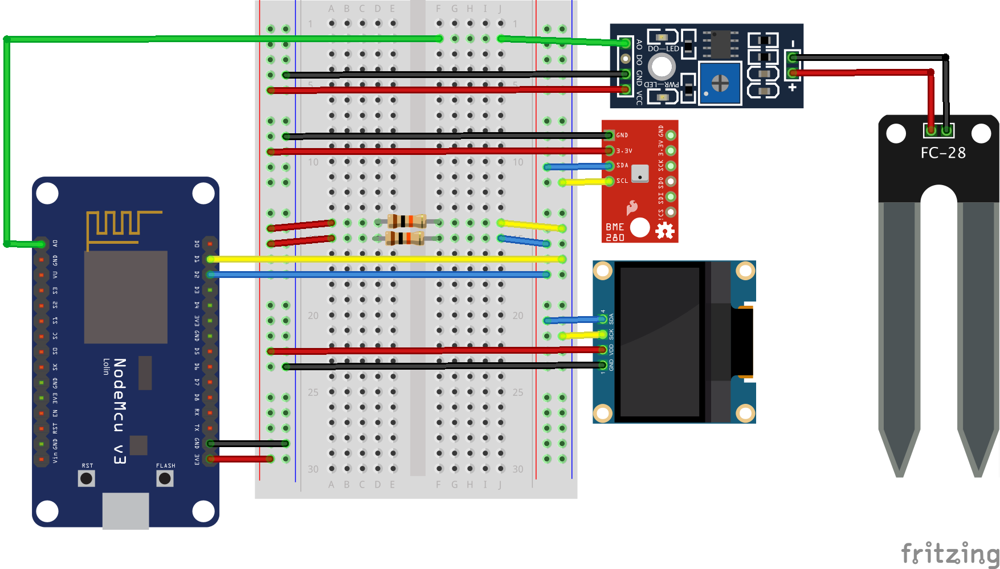

# Home automation with a nodemcu v3 via Telegram Bot


## Requeriments

- Arduino IDE and/or VSCode (via [vscode-arduino](https://marketplace.visualstudio.com/items?itemName=vsciot-vscode.vscode-arduino) plugin)
- [nodeMCU v3 devkit](https://en.wikipedia.org/wiki/NodeMCU)

## Install

- Install libraries:
  - [CTBot]
  - [Adafruit BME280]
  - [Adafruit Unified Sensor]
  - [Adafruit SSD1306]
  - [NTPClient Fabrice]
  - [ArduinoJson] (version 5.13.4 at the time of writing, not the last one because fails to compile!!)
- Follow instructions on how to create a Telegram Bot, via telegram bot BotFather or see examples insiee CTBot library
- Rename file secrets.h_dist -> secrets.h changing all definitions
- Connect nodemcu using usb to the computer
- Configure Arduino Board to "nodeMCU v1.0"
- Select port (e.g. maybe /dev/ttyUSB0 on linux // maybe /dev/cu_.... on mac)
- Upload Sketch to nodeMCU ¹
- Open Serial Monitor
- Test if messages are sent to the serial port and the OLED screen show information

## Issues

¹ On linux maybe is needed to allow write permissions to the USB

```sh
sudo chmod a+rw /dev/ttyUSB0
```

## Debug

Some information is sent to serial, so is it possible to check if the wifi is already connected, etc...

## Telegram Bot

Example bot output


Customize icon, commands via BotFather

## REST API

Created a JSON REST API to get weather information (no security!)
Change "weather.local" or established hostName to ip if mDNS does not work

```rest
GET http://weather.local/api/v1/weather
```

## Schema & Parts list



- [Schema on fritzing](https://fritzing.org/projects/nodemcu-bot)
- [Fritzing schema](doc/fritzing/nodemcu-bot2.fzz)
- [Shopping list](https://htmlpreview.github.com/?https://github.com/marcelmiguel/nodemcubot/blob/master/doc/fritzing/nodemcu-bot_bom.html)
- Fritzing parts at ./doc/fritzing/parts/

## Calibrating Moisture Sensor

Now that you have a functioning soil moisture sensor, how do you get some useful data out of it?

Take note of the number that flashes across the screen on your serial monitor inside of the Arduino IDE while your sensor is completely dry, it is usually 9XX if you have your soil moisture sensor plugged into 3V on your ESP8266 Development board. Next, completely submerge your soil moisture leads in a small cup of water. Be careful not to submerge the wires during this step as this could damage your electronic hardware.

As soon as you submerge your sensor in the water, keep an eye on the serial monitor. You will see the readings jump to a different value!!!!!

In mine (yours may be slightly different), a completely dry sensor gives a reading of about ~750, while a completely wet sensor reads consistently around ~180. Taking these numbers, we are going to add a few lines of code to our Arduino Sketch to map these values to a more familiar percentage (%).

First, we need to convert the values we are getting to a percentage, and we can do this using the map function.

```c++
output_value = map(output_value,750,180,0,100);
```

This simple function takes our 2 values and converts them from 0 - 100% based on their number between each other. The first number you put into the map function is the sensor value when it is completely dry, next comes the wet value. The following values are the map values, 0 being 0% and 100 being 100%.
