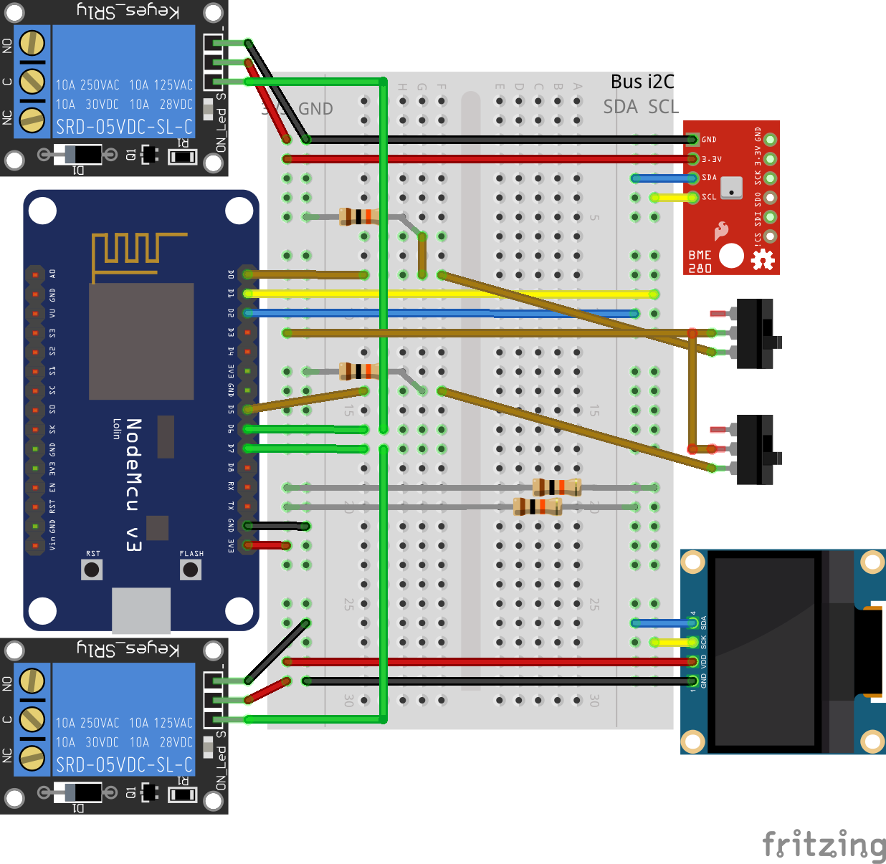

# Home automation with a nodemcu v3 via Telegram Bot


## Requeriments

- Arduino IDE and/or VSCode (via [vscode-arduino](https://marketplace.visualstudio.com/items?itemName=vsciot-vscode.vscode-arduino) plugin)
- [nodeMCU v3 devkit](https://en.wikipedia.org/wiki/NodeMCU)

## Install

- Install libraries:
  [CTBot]
  [UniversalTelegramBot]
  [Adafruit BME280]
  [Adafruit Unified Sensor]
  [Adafruit SSD1306]
  [NTPClient Fabrice]
  [ArduinoJson] (version 5.13.4 at the time of writing, not the last one because fails to compile!!)
  [WakeOnLan by a7md0 Version 1.1.6]
- Follow instructions on how to create a Telegram Bot, via telegram bot BotFather or see examples insiee CTBot library
- Rename file secrets.h_dist -> secrets.h changing all definitions
- Connect nodemcu using usb to the computer
- Configure Arduino Board to "nodeMCU v1.0"
- Check on Board Manager that ESP8266 is versions 2.7,1
- Select port (e.g. maybe /dev/ttyUSB0 on linux // maybe /dev/cu_.... on mac)
- Upload Sketch to nodeMCU ¹
- Open Serial Monitor
- Test if messages are sent to the serial port and the OLED screen show information

## Issues

¹ On linux maybe is needed to allow write permissions to the USB

``` sh
sudo chmod a+rw /dev/ttyUSB0
```

## Debug

Some information is sent to serial, so is it possible to check if the wifi is already connected, etc...

## Telegram Bot

Example bot output


Customize icon, commands via BotFather

List of commands (commands must be lowercase):

```telegram
motionon - Active motion on OVO
motionoff - Disable motion on OVO
temp - Get temperature of computers
pressure - Get pressure of computers
humidity - Get humidity of computers
altitude - Get altitude of computers
tempovo - Get temp inside cabin
weight - Weight inside cabin
position - Position of cabin
wolpc1 - Start computer PC1
wolpc2 - Start computer PC2
```

## Web Page


## REST API

Created a JSON REST API to get weather information (no security!)
Change "weather.local" or established hostName to ip if mDNS does not work

``` rest
GET http://weather.local/api/v1/weather
GET http://weather.local/api/v1/relay/1/on
GET http://weather.local/api/v1/relay/1/off
GET http://weather.local/api/v1/relay/2/on
GET http://weather.local/api/v1/relay/2/off

GET http://192.168.1.46/api/v1/weather
GET http://192.168.1.46/api/v1/relay/1/on
GET http://192.168.1.46/api/v1/relay/1/off
GET http://192.168.1.46/api/v1/relay/2/on
GET http://192.168.1.46/api/v1/relay/2/off
```


## Schema & Parts list



- [Schema on fritzing](https://fritzing.org/projects/nodemcu-bot)
- [Fritzing schema](doc/fritzing/nodemcu-bot.fzz)
- [Shopping list](https://htmlpreview.github.com/?https://github.com/marcelmiguel/nodemcubot/blob/master/doc/fritzing/nodemcu-bot_bom.html)
- Fritzing parts at ./doc/fritzing/parts/

